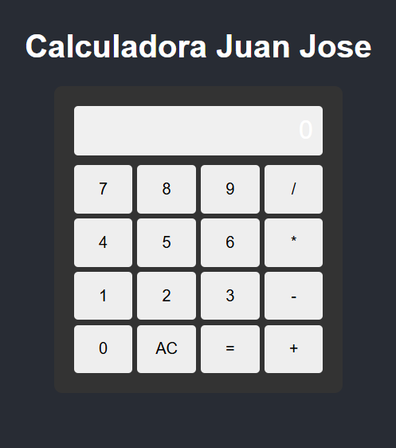

# 🧮 Calculadora en React

Este es un proyecto de una **calculadora básica** creada con **React + Vite**, desarrollada por **Juan Jose**. Permite realizar operaciones matemáticas simples como suma, resta, multiplicación y división.

---

## 🚀 Tecnologías utilizadas

- ⚛️ React
- ⚡ Vite
- 💅 CSS (estilos simples)

---

## 📸 Vista previa

 

---

## 🧠 Funcionalidades

- ✅ Operaciones básicas: suma, resta, multiplicación y división.
- ✅ Teclado visual (buttons) para números y operadores.
- ✅ Interfaz limpia y responsive.
- ✅ Manejo de errores simples (ej. división por cero).

---

## 🛠️ Instalación y uso

1. Clona el repositorio:
   ```bash
   [git clone https://github.com/Alastor29/4-calculadora-react-JuanJoseDorado.git](https://github.com/FSDSTR0225/4-calculadora-react-JuanJoseDorado.git)
   ```
